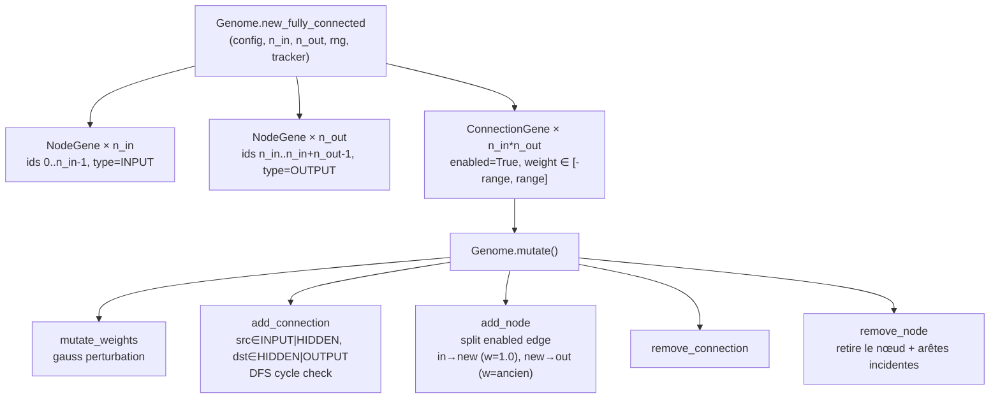

# Phase 2 — Génome : genome.py + tests

## Contexte

Phase 1 en place (SimConfig immuable, chargé depuis YAML). Phase 2 introduit
la **structure de données du génome NEAT** : représentation des nœuds et
connexions, compteur d'innovations global, et les 5 opérateurs de mutation.

Le génome est une **pure structure de données** — il ne sait pas s'évaluer.
L'évaluation est déléguée à `network.py` (Phase 3), séparation stricte des
responsabilités.

Choix validés :
- **Style NEAT standard** : `NodeGene` + `ConnectionGene` avec flag `enabled`
  (les connexions désactivées par `add_node` restent dans la liste).
- **Strictement feedforward** : `add_connection` vérifie l'absence de cycle par
  DFS avant chaque insertion (invariant n°3). Si cycle → essai inverse ; si
  toujours cycle → abandon.
- **Déterminisme** : chaque opérateur stochastique reçoit un `random.Random`
  injecté.
- **`InnovationTracker`** global (`TRACKER`) partageable entre agents ; tracker
  local possible pour les tests (isolation).

## Architecture du génome

## Fichiers créés

### 1. `src/genome.py`

**Constantes** : `INPUT = "input"`, `HIDDEN = "hidden"`, `OUTPUT = "output"`.

**`NodeGene`** (`@dataclass`) :
- `node_id: int`, `node_type: str`

**`ConnectionGene`** (`@dataclass`) :
- `in_node: int`, `out_node: int`, `weight: float`, `enabled: bool`, `innovation: int`

**`InnovationTracker`** :
- `next_node_id()` → entier unique croissant
- `innovation_for(in_node, out_node)` → numéro d'innovation, stable pour une même
  paire (même mutation structurelle = même innovation)
- `bump_node_floor(floor)` → garantit que les ids cachés ne collisionnent pas
  avec les ids input/output réservés
- `reset()` → pour les tests déterministes

**`Genome`** :
- `new_fully_connected(config, num_inputs, num_outputs, rng, tracker)` : inputs
  ids `0..n-1`, outputs ids `n..n+m-1`, tracker floored à `n+m`
- `clone()` : copie profonde indépendante
- `to_dict()` / `from_dict()` / `to_json()` / `from_json()` : sérialisation JSON

**Mutations** :
| Méthode | Comportement |
|---|---|
| `mutate_weights` | Perturbe chaque poids avec proba `weight_mutation_rate` (gauss σ=`weight_perturbation`) |
| `add_connection` | Choisit src (INPUT/HIDDEN) et dst (HIDDEN/OUTPUT) au hasard ; DFS cycle check ; si cycle → essai inverse ; si toujours cycle → `False` |
| `add_node` | Désactive une arête activée ; insère un nœud caché ; crée `in→new (w=1.0)` et `new→out (w=ancien)` |
| `remove_connection` | Retire une connexion aléatoire |
| `remove_node` | Retire un nœud caché aléatoire + toutes ses arêtes incidentes |
| `mutate` | Appelle les 5 opérateurs dans l'ordre, chacun conditionné à son taux |

**Helper privé** `_creates_cycle(in_node, out_node)` : DFS depuis `out_node`,
retourne `True` si `in_node` est atteignable (cycle détecté avant insertion).

### 2. `tests/test_genome.py` — 16 tests

| Test | Ce qu'il vérifie |
|---|---|
| `test_new_fully_connected_shape` | n_inputs × n_outputs connexions, tous enabled, pas de cycle |
| `test_node_ids_are_unique` | ids uniques ; outputs à {33, 34} |
| `test_weights_within_init_range` | poids ∈ [−range, +range] |
| `test_clone_is_independent` | modification du clone n'affecte pas l'original |
| `test_json_round_trip` | sérialisation/désérialisation identique |
| `test_innovation_same_edge_same_number` | même paire → même innovation |
| `test_tracker_node_floor` | `bump_node_floor` force le plancher |
| `test_tracker_reset` | reset repart à 0 |
| `test_mutate_weights_changes_weights` | les poids changent après mutation |
| `test_add_node_splits_connection` | +1 nœud, +2 connexions, 1 désactivée, pas de cycle |
| `test_add_connection_no_duplicates_or_cycles` | 200 tentatives → pas de doublon, pas de cycle |
| `test_creates_cycle_detection` | `0→1→2` : ajouter `2→0` détecté, `0→2` non |
| `test_remove_connection` | longueur −1 |
| `test_remove_node_removes_incident_edges` | nœud + arêtes retirés |
| `test_remove_node_no_hidden_returns_false` | `False` sans nœuds cachés |
| `test_mutation_is_deterministic_with_seed` | même seed → même résultat |

## Vérification
1. `python -m pytest tests/test_genome.py -v` → 16 verts.
2. `python -m pytest tests/ -v` → non-régression Phase 1 (32 tests total).
3. `black src/genome.py && pylint src/genome.py` → propre.
4. Commit dédié Phase 2.

## Hors périmètre (Phase 2)
- Évaluation du réseau (forward pass) → Phase 3.
- Crossover (alignement par innovation) → non prévu dans ce projet.
- Sérialisation vers S3 → Phase 9.
