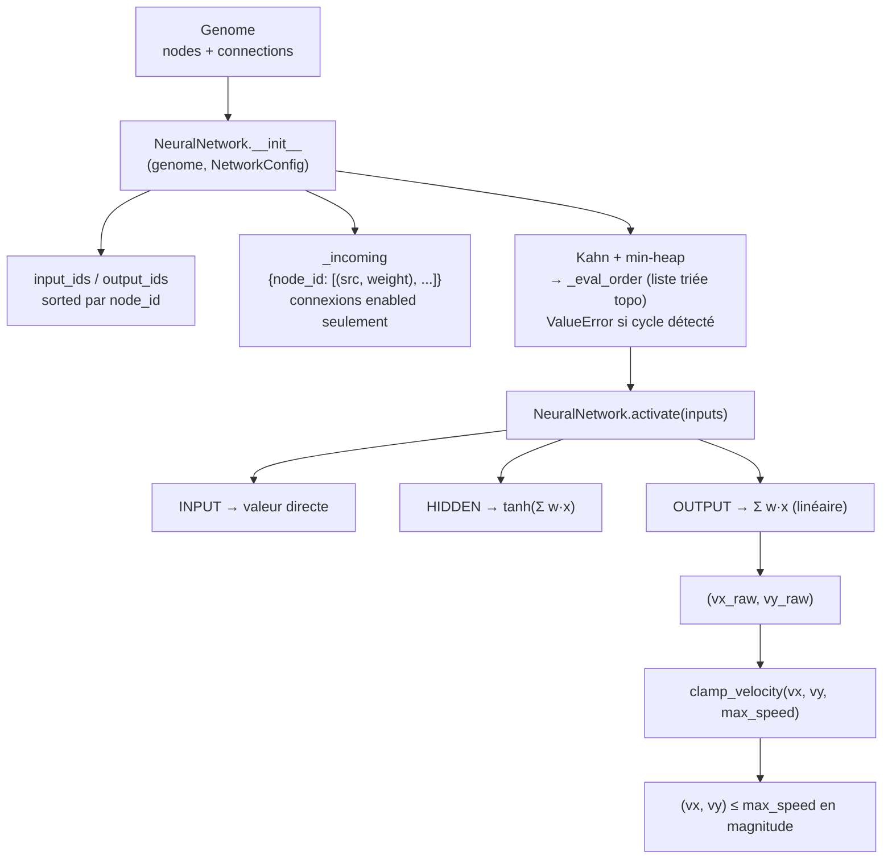

# Phase 3 — Réseau de neurones : network.py + tests

## Contexte

Phases 1-2 en place (SimConfig + Genome). Phase 3 **compile** un Genome en
réseau exécutable : à partir de la structure de données génomique, produire les
sorties `(vx_brut, vy_brut)` pour un vecteur d'entrée de 33 floats.

Deux invariants CLAUDE.md critiques pilotent le design :
- **Invariant n°4** : tri topologique calculé **une seule fois** à la
  construction du réseau (création de l'agent), jamais recalculé pendant la vie
  de l'agent.
- **Invariant n°5** : vitesse normalisée post-sortie —
  `speed = min(|(vx,vy)|, max_speed)`, `direction = (vx,vy)/|(vx,vy)|`.

Choix validés :
- **Nœuds cachés → `tanh`** (config `network.activation`), **nœuds de sortie
  → linéaire** (somme pondérée brute). Avec `tanh` partout, `|v| ≤ √2 < 3` et
  le clamp ne se déclencherait jamais ; la sortie linéaire rend `max_speed`
  réellement utile.
- **Pur Python + `math`** (pas de NumPy) : topologie creuse et irrégulière,
  overhead NumPy non justifié pour des réseaux de taille variable.
- **`clamp_velocity` = fonction libre**, pas méthode de `NeuralNetwork` :
  le réseau ne dépend pas de `AgentConfig` ; c'est l'agent (Phase 5) qui
  appellera `activate()` puis `clamp_velocity()`.

## Architecture



## Fichiers créés

### 1. `src/network.py`

**`_ACTIVATIONS`** : registre `dict[str, Callable]` — actuellement `{"tanh": math.tanh}`.
Extensible sans toucher au reste du code.

**`_get_activation(name)`** : lève `ValueError` clair si l'activation n'est pas connue.

**`class NeuralNetwork`** :

`__init__(genome, config)` calcule et stocke en une seule passe :
- `input_ids`, `output_ids` : nœuds triés par `node_id` (ordre stable)
- `_incoming` : `{node_id: [(src_id, weight)]}` sur les connexions **`enabled`**
  seulement (les connexions désactivées par `add_node` sont ignorées partout)
- `_eval_order` : tri topologique via **algorithme de Kahn sur min-heap**
  (pop toujours le `node_id` minimal → ordre déterministe, indépendant de l'ordre
  de la liste `genome.connections`)
- Si `len(_eval_order) != len(genome.nodes)` → `ValueError("genome contains a cycle...")`

`activate(inputs)` :
1. Vérifie `len(inputs) == len(input_ids)`
2. Parcourt `_eval_order` : INPUT → copie directe ; HIDDEN → `tanh(total)` ;
   OUTPUT → `total` (linéaire)
3. Retourne `(values[output_ids[0]], values[output_ids[1]])`

> `_eval_order` est **le même objet** avant et après `activate()` — jamais réaffecté
> (invariant n°4 vérifiable par `assert nn._eval_order is order_before`).

**`clamp_velocity(vx, vy, max_speed)`** :
```python
mag = math.hypot(vx, vy)
if mag > max_speed:
    scale = max_speed / mag
    return (vx * scale, vy * scale)
return (vx, vy)
```
Cas `(0, 0)` : `hypot = 0 ≤ max_speed` → retourné tel quel, pas de division par zéro.

### 2. `tests/test_network.py` — 14 tests

| Test | Ce qu'il vérifie |
|---|---|
| `test_known_topology` | Petit génome manuel (inputs 0,1 → hidden 4 → outputs 2,3), calcul à la main : `h=tanh(0.5·x0−1.0·x1)`, sorties linéaires |
| `test_known_topology_nonzero_hidden` | Même génome, entrées non-triviales pour activer `tanh(2)` |
| `test_output_independent_of_connection_order` | Même génome avec `connections.reverse()` → sorties **identiques** (prouve que l'ordre d'exécution vient du tri topo, pas de la liste) |
| `test_forward_deterministic` | Deux réseaux du même génome, même input → sorties égales ; deux appels successifs égaux |
| `test_cycle_raises` | Génome `0→1→2→0` → `NeuralNetwork(...)` lève `ValueError` |
| `test_disabled_connection_ignored` | Arête `enabled=False` ne change pas la sortie vs. arête absente |
| `test_output_with_no_incoming_is_zero` | Output sans arête entrante → `0.0` (total = 0, sortie linéaire) |
| `test_input_length_validation` | Mauvaise longueur d'input → `ValueError` |
| `test_eval_order_cached` | `nn._eval_order is order_before` après `activate()` — invariant n°4 |
| `test_clamp_velocity_no_clamp` | `\|v\| < max_speed` → inchangé |
| `test_clamp_velocity_clamps_magnitude` | `(4, 0), max=3` → `hypot ≈ 3`, direction préservée |
| `test_clamp_velocity_diagonal` | `(3, 4), max=2` → `hypot ≈ 2`, ratio `vx/vy` constant |
| `test_clamp_velocity_zero` | `(0, 0)` → `(0, 0)`, pas d'erreur |
| `test_full_network_finite` | Réseau `33×2` avec 10 passes aléatoires → sorties finies |

## Vérification
1. `python -m pytest tests/test_network.py -v` → 14 verts.
2. `python -m pytest tests/ -v` → non-régression Phases 1-2 (46 tests total).
3. `black src/network.py tests/test_network.py && pylint src/network.py` → 10.00/10.
4. Smoke :
```bash
python -c "
from src.config import SimConfig
from src.genome import Genome
from src.network import NeuralNetwork, clamp_velocity
from random import Random
c = SimConfig.from_yaml('config/default.yaml')
g = Genome.new_fully_connected(c.genome, 33, 2, Random(0))
nn = NeuralNetwork(g, c.network)
print(clamp_velocity(*nn.activate([0.0]*33), c.agent.max_speed))
"
```
→ `(0.0, 0.0)` (réseau pleinement connecté, entrées nulles, poids symétriques annulés par tanh(0)).

## Hors périmètre (Phase 3)
- Raycasts et construction des 33 inputs → Phase 5.
- Intégration agent (appel `activate` + `clamp_velocity` à chaque tick) → Phase 5.
- Batching NumPy pour la population entière → non prévu (réseau par agent).
