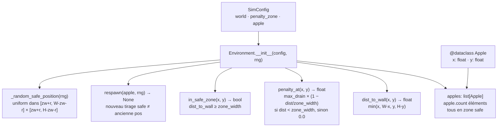

# Phase 4 — Environnement : environment.py + apple.py + tests

## Contexte

Phases 1–3 en place (SimConfig, Genome, NeuralNetwork). Phase 4 introduit le
**monde physique** dans lequel les agents vont évoluer : les pommes (sources de
nourriture) et le champ de pénalité murale. C'est un module de géométrie pure —
aucun agent, aucun eating, aucun rendu à ce stade.

Deux invariants CLAUDE.md critiques pilotent le design :
- **Invariant n°1 — zéro hardcoding** : chaque paramètre provient de `SimConfig`
  (`world`, `penalty_zone`, `apple`).
- **Invariant n°6 — pommes en zone safe stricte** : les pommes spawnent UNIQUEMENT
  hors zone pénalité ; le corps entier (rayon compris) reste dans la zone safe.
- **Déterminisme** : toute opération stochastique reçoit un `random.Random` injecté
  (même pattern que `genome.py`).

Choix validés :
- **Corps entier en zone safe** : spawn inset de `apple.radius`, soit
  `dist_mur(centre) ≥ penalty_zone.width + apple.radius`.
- **Respawn = nouveau tirage distinct** : re-roll si la position tombe exactement
  sur l'ancienne (en pratique jamais avec des floats uniformes). Pas de nouveau
  paramètre config.

## Architecture



## Fichiers créés

### 1. `src/apple.py`

`@dataclass` minimaliste, mutable :

```python
@dataclass
class Apple:
    x: float
    y: float
```

Énergie et rayon sont des constantes globales (identiques pour toutes les pommes),
stockées dans `AppleConfig` et lues par `Environment`. Aucune logique ici — principe
de responsabilité unique (placement → `Environment`).

### 2. `src/environment.py`

**`class Environment`** :

`__init__(config, rng)` :
1. Stocke `config.world`, `config.penalty_zone`, `config.apple`.
2. Calcule les bornes du rectangle safe pour les centres :
   `x_min = zw + r`, `x_max = W - zw - r`, idem en Y.
3. Lève `ValueError` si `x_max <= x_min` ou `y_max <= y_min` (zone safe vide).
4. Crée `apple.count` pommes via `_random_safe_position(rng)`.

Méthodes publiques :
| Méthode | Contrat |
|---|---|
| `dist_to_wall(x, y) → float` | `min(x, W-x, y, H-y)` |
| `penalty_at(x, y) → float` | Gradient `max_drain×(1−dist/zw)` si `dist<zw`, sinon `0.0` |
| `in_safe_zone(x, y) → bool` | `dist_to_wall(x,y) >= zone_width` (usage agents Phase 5) |
| `respawn(apple, rng) → None` | Tire une nouvelle position distincte, met à jour `apple.x/y` |

Méthode privée : `_random_safe_position(rng)` — `rng.uniform` dans le rectangle
inset (spawn body-safe).

Pas de méthode `tick` — la consommation d'énergie et la détection de collision
appartiennent à la Phase 5 (agent).

### 3. `tests/test_environment.py` — 10 tests

| Test | Ce qu'il vérifie |
|---|---|
| `test_apple_count` | `len(env.apples) == config.apple.count` |
| `test_apples_in_safe_zone_full_body` | Chaque pomme : `dist_to_wall(x,y) >= zw + r` |
| `test_determinism` | Deux `Environment(cfg, Random(42))` → positions identiques |
| `test_respawn_changes_position` | Après `respawn`, position différente |
| `test_respawn_stays_in_safe_zone` | Nouvelle position : `dist_to_wall >= zw + r` |
| `test_penalty_at_wall` | `penalty_at(0, H/2) == max_drain` |
| `test_penalty_gradient_midpoint` | `penalty_at` à `dist=zw/2` ≈ `max_drain/2` |
| `test_penalty_at_boundary` | `penalty_at` à `dist=zw` → `0.0` |
| `test_penalty_zero_in_safe_zone` | Centre du monde → `0.0` |
| `test_in_safe_zone` | `in_safe_zone` vrai au centre, faux à `dist < zw` |

## Vérification

1. `python -m pytest tests/test_environment.py -v` → 10 verts.
2. `python -m pytest tests/ -v` → non-régression Phases 1–3 (≥ 46 tests).
3. `black src/environment.py src/apple.py tests/test_environment.py && pylint src/environment.py src/apple.py` → 10.00/10.
4. Smoke :
```bash
python -c "
from random import Random
from src.config import SimConfig
from src.environment import Environment
c = SimConfig.from_yaml('config/default.yaml')
env = Environment(c, Random(0))
print('apples:', len(env.apples))
print('penalty@wall:', env.penalty_at(0, 450))
print('penalty@safe:', env.penalty_at(800, 450))
a = env.apples[0]; old=(a.x,a.y); env.respawn(a, Random(1))
print('moved:', (a.x,a.y) != old, env.in_safe_zone(a.x, a.y))
"
```
5. Mettre à jour `PLAN.md` Phase 4 → `[x]`. Commit `feat: Phase 4 — environment.py + apple.py + tests`.

## Hors périmètre (Phase 4)

- Collision agent/pomme, eating → Phase 5.
- Application de `penalty_at` à l'énergie de l'agent chaque tick → Phase 5/6.
- Rendu des pommes et de la zone pénalité → Phase 7.
