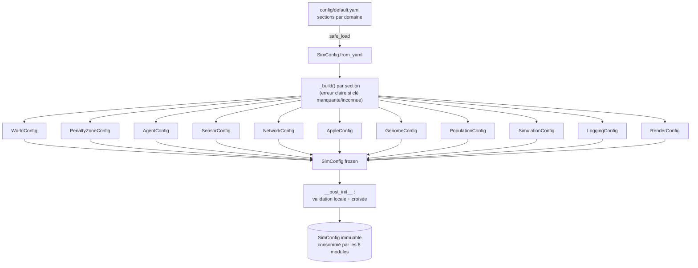

# Phase 1 — Fondations : config.py + default.yaml + tests

> ⚠️ **Archive** : ce document décrit l'implémentation *d'origine* (33 inputs,
> monde 1600×900, `population.min_size`...). Ces valeurs ont depuis changé
> plusieurs fois (poc2.2/poc2.3). Pour l'état ACTUEL du projet, voir
> `docs/SYNTHESE.md` et `config/default.yaml`.

## Contexte

Le dépôt est vierge (seuls `CLAUDE.md` et `PLAN.md` existent). La Phase 1
est la fondation de tout le projet : l'**invariant n°1** impose que *tout*
paramètre vienne de `SimConfig` chargé depuis YAML — aucun nombre magique
dans le code. Les 8 modules suivants liront leurs paramètres via cet objet,
donc sa structure et son périmètre conditionnent tout l'aval.

Cette phase pose aussi le squelette projet (arborescence `src/`, `tests/`,
`config/`, `requirements.txt`, config outillage black/pylint/pytest).

Choix validés avec l'utilisateur :
- **Dataclasses imbriquées** par domaine (`config.agent.max_speed`), mappées 1:1 sur les sections YAML.
- **Périmètre P2–P8** (monde, agent, capteurs, réseau, pomme, génome, population, simulation, logging, rendu). AWS/Phase 9 reporté.
- **`frozen=True` + validation** dans `__post_init__`.

## Architecture de la config

## Fichiers à créer

### 1. `src/config.py`
- `from __future__ import annotations`, imports : `dataclasses`, `pathlib.Path`, `yaml`.
- Une classe d'exception `ConfigError(Exception)` pour les erreurs de chargement/validation lisibles.
- Une sous-dataclass `frozen=True` par section (voir liste ci-dessous). Chacune a un `__post_init__` de **validation locale** (valeurs strictement positives là où c'est attendu, taux de mutation ∈ [0,1], etc.).
- `SimConfig(frozen=True)` composant les 11 sous-configs.
- Helper privé `_build(cls, section: str, data: dict)` : construit une sous-dataclass à partir de `data[section]` en levant `ConfigError` explicite si la section manque, si une clé est absente, ou si une clé inconnue est présente (`TypeError` → message clair). Évite la duplication des `try/except`.
- `SimConfig.from_dict(data: dict) -> SimConfig` : appelle `_build` pour chaque section.
- `SimConfig.from_yaml(path: str | Path) -> SimConfig` : `yaml.safe_load` du fichier (lève `ConfigError` si fichier absent/illisible) puis `from_dict`.
- `SimConfig.__post_init__` : **validation croisée** —
  - `network.num_inputs == 2 * sensors.num_rays + 1` (cohérence des 33 entrées),
  - `network.num_outputs == 2`,
  - `penalty_zone.width < min(world.width, world.height) / 2` (laisse une zone safe),
  - `agent.reproduction_cost <= agent.reproduction_threshold`,
  - `agent.max_energy >= agent.initial_energy`,
  - `population.min_size <= population.initial_size <= population.max_size`.

> Note : `__post_init__` d'une dataclass `frozen` peut lire les champs et lever sans problème (validation en lecture seule, aucune affectation).

### 2. `config/default.yaml`
Toutes les sections ci-dessous. Valeurs = points de départ raisonnables (la **calibration fine est Phase 8**), unités notées en commentaire — énergie en **pommes-équivalent par tick** (invariant n°2).

| Section | Clés (valeur de départ) |
|---|---|
| `world` | `width: 1600`, `height: 900` |
| `penalty_zone` | `width: 100` (px depuis le mur), `max_drain: 0.05` (énergie/tick au contact) |
| `agent` | `radius: 8`, `max_speed: 3.0`, `initial_energy: 1.0`, `max_energy: 2.0`, `energy_drain_per_tick: 0.001`, `max_age: 5000`, `reproduction_threshold: 1.5`, `reproduction_cost: 0.75`, `end_of_life_ticks: 500` |
| `sensors` | `num_rays: 16`, `max_distance: 200`, `fov: 360` (degrés) |
| `network` | `num_inputs: 33`, `num_outputs: 2`, `activation: "tanh"` |
| `apple` | `count: 50`, `radius: 5`, `energy: 0.5` |
| `genome` | `weight_init_range: 1.0`, `weight_mutation_rate: 0.8`, `weight_perturbation: 0.2`, `add_node_rate: 0.03`, `add_connection_rate: 0.05`, `remove_node_rate: 0.01`, `remove_connection_rate: 0.02` |
| `population` | `initial_size: 30`, `min_size: 5`, `max_size: 100` |
| `simulation` | `ticks_per_second: 60`, `max_ticks: 0` (0 = illimité), `seed: 42` |
| `logging` | `csv_path: "logs/metrics.csv"`, `log_interval_ticks: 100`, `best_genome_path: "logs/best_genome.json"` |
| `render` | `fps: 60`, `window_width: 1600`, `window_height: 900` |

> Les couleurs/HUD détaillés du renderer (Phase 7) seront ajoutés dans `render` à ce moment-là ; on garde ici le minimum nécessaire pour démarrer.

### 3. `tests/test_config.py` (pytest)
- `test_load_default_yaml` : `SimConfig.from_yaml("config/default.yaml")` renvoie un `SimConfig` ; accès imbriqué OK (`cfg.agent.max_speed == 3.0`, `cfg.sensors.num_rays == 16`).
- `test_inputs_consistency` : `cfg.network.num_inputs == 2 * cfg.sensors.num_rays + 1`.
- `test_frozen` : affecter un champ lève `dataclasses.FrozenInstanceError`.
- `test_missing_section` / `test_unknown_key` / `test_missing_file` : lèvent `ConfigError` avec message clair.
- `test_cross_validation` : un dict avec `penalty_zone.width` trop grande, ou `num_inputs` incohérent, ou `reproduction_cost > reproduction_threshold` lève `ConfigError`.
- `test_local_validation` : valeur négative (ex. `max_speed: -1`) ou taux hors [0,1] lève `ConfigError`.
- `test_from_dict` : construit depuis un petit dict valide et vérifie les valeurs.

Utiliser `tmp_path` pour les YAML invalides écrits à la volée.

### 4. Squelette projet
- `requirements.txt` : `pygame`, `numpy`, `pyyaml`, `pytest`, `pylint`, `black` (versions épinglées en `>=`).
- `src/__init__.py` et `tests/__init__.py` (vides).
- `pyproject.toml` : config `black` (line-length) + section `[tool.pytest.ini_options]` (`testpaths = ["tests"]`) + config `pylint` minimale (ou `.pylintrc`) cohérente avec black.
- `logs/.gitkeep` pour que les chemins de logging existent (le dossier `logs/` n'est pas commité avec ses contenus — ajouter `logs/*` sauf `.gitkeep` au `.gitignore` avec aussi `__pycache__/`, `.pytest_cache/`).

## Vérification
1. `python -m pytest tests/test_config.py -v` → tous verts.
2. `python -c "from src.config import SimConfig; print(SimConfig.from_yaml('config/default.yaml').agent.max_speed)"` → `3.0`.
3. `black src/ tests/ && pylint src/` → formaté, score propre (pas d'erreur).
4. Commit dédié Phase 1 une fois les tests verts (discipline « commit après chaque module testé »).

## Hors périmètre (Phase 1)
- Toute logique de simulation/génome/réseau.
- Paramètres AWS (S3/DynamoDB/Amplify) — Phase 9.
- Couleurs/HUD détaillés du renderer — Phase 7.